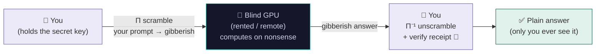

<div align="center">

# 🐯 Altaica Mesh

### Run frontier AI on *someone else's* GPU — that **can't read your data**.

*A blindfolded tiger does the heavy lifting. Only you ever see the answer.*

<br>

[](LICENSE)
[](#-the-blindness-honestly)
[](requirements.txt)
[](CONTRIBUTING.md)

<br>

🐅 **The prompt is yours. The GPU is theirs. The data stays blind to them.** 🐅

</div>

<!-- 🎥 VIDEO: replace VIDEO_ID below with your YouTube id after you upload the clip -->
<div align="center">

[](https://youtu.be/VIDEO_ID)

**▶ Watch the 2-minute demo** *(click the tiger above)*

</div>

---

<div align="center">

*One line, many tongues* 🌍

🇬🇧 AI on a borrowed GPU that can't read your data.
🇨🇳 在借来的 GPU 上运行 AI，而它读不到你的数据。
🇪🇸 IA en una GPU prestada que no puede leer tus datos.
🇫🇷 De l'IA sur un GPU emprunté qui ne peut pas lire vos données.
🇩🇪 KI auf einer geliehenen GPU, die deine Daten nicht lesen kann.
🇯🇵 借りた GPU で動く、あなたのデータを読めない AI。
🇮🇳 उधार के GPU पर चलने वाला AI जो आपका डेटा नहीं पढ़ सकता।
🇸🇦 ذكاء اصطناعي على معالج مستعار لا يستطيع قراءة بياناتك.
🇧🇷 IA numa GPU emprestada que não consegue ler seus dados.
🇷🇺 ИИ на чужом GPU, который не может прочитать ваши данные.

</div>

---

## 🐾 Why this exists (in plain words)

You want to use a big, smart AI model. You have two normal choices, and both ask you to give something up:

- ☁️ **Cloud API** (ChatGPT, etc.) — powerful, but the company's servers **see everything you type**.
- 🏠 **Local AI** (like **Ollama**) — totally private, but you're stuck with whatever **your own computer** can run. Frontier models won't fit on a laptop.

**Altaica Mesh is the third door.** It **scrambles the model's weights** with a secret key only *you* hold, so a remote GPU can do the work while seeing nothing but **gibberish**. You get cloud-scale models *and* local-grade privacy — and a **signed receipt** proving the answer is real and untampered.

> Think of it as a **blindfolded tiger**: immensely powerful, does all the hunting, but never sees what it's carrying. 🐯💨

---

## 🆚 Altaica vs. the alternatives

| | ☁️ Cloud API | 🏠 Ollama (local) | 🐯 **Altaica Mesh** |
|---|:---:|:---:|:---:|
| **Where it runs** | their server | *your* machine | someone else's GPU |
| **Can the host read your prompt?** | 🔴 Yes | 🟢 N/A (it's you) | 🟢 **No — blind** |
| **Run models too big for your hardware?** | 🟢 Yes | 🔴 No | 🟢 **Yes** |
| **Need your own expensive GPU?** | 🟢 No | 🔴 Yes | 🟢 **No** |
| **Split one giant model across many GPUs?** | — | 🔴 No | 🟢 **Yes (sharded)** |
| **Cryptographic receipt of each answer?** | 🔴 No | 🔴 No | 🟢 **Yes (ML-DSA / post-quantum)** |
| **Who do you trust?** | the company | yourself | **yourself + math** |

**Short version:** Ollama keeps you private by keeping you *small and local*. Altaica keeps you private while letting you go *big and borrowed*. 🐅

---

## 🧶 How it works (3 pounces)



1. **🙈 Blindfold the tiger.** On *your* device, a secret rotation `P` + permutation `Π` scrambles the model's weights. The scrambled model is just a normal model with shuffled, rotated weights — it runs on **stock vLLM at full speed**.
2. **🐯 Let it hunt.** The remote GPU runs the scrambled model on your scrambled prompt. It has no keys, no tokenizer — to it, your prompt is meaningless numbers.
3. **🧡 Bring the answer home.** Your device unscrambles the result and checks the **post-quantum signed receipt**. The plaintext answer exists *only* on your side.

The magic: the scramble is a **rotation that mathematically cancels out** — so the answer is **token-for-token identical** to the original model. Same answer, blind tiger.

---

## 🔒 The blindness, honestly

We measure three things separately and never blur them (honesty is the whole point):

| Guarantee | In plain words | Measured |
|---|---|---|
| 🎯 **Exact** | Same answer as the original model. | Token-for-token identical (bf16); the MoE router even picks the same experts. |
| 🙈 **Private** | A keyless GPU can't turn what it sees back into your words. | True-token recovery **≈ 0.033%** vs a 5% bar. |
| 🔏 **Verifiable** | Every answer is signed & checkable. | **ML-DSA-65** (FIPS-204) post-quantum receipt + SHA3 Merkle. |

> 🐾 **Honest paw-print:** this is **computational** privacy (hard to reverse), not information-theoretic (impossible to reverse). The lock is the secret permutation `Π` staying on your device. We'd rather say that than oversell it.

---

## 🏥 Who's it for? Use cases & industries

Anyone who must run AI on data they can't expose to the compute provider:

| Industry | Example |
|---|---|
| 🏥 **Healthcare & life sciences** | Summarize patient records / run a big medical LLM on rented cloud GPUs **without HIPAA data ever leaving your control**. |
| 🏦 **Finance & banking** | Analyze transactions or client docs on spare datacenter capacity, blind to the host. |
| ⚖️ **Legal** | Review privileged, confidential case files on a borrowed GPU. |
| 🏛️ **Government & public sector** | Process sensitive citizen data without trusting the cloud operator. |
| 🛡️ **Insurance & pharma** | Claims, trials, and proprietary research kept confidential from infrastructure. |
| 🧪 **Researchers & startups** | Run **frontier-scale** models (too big for one GPU) by **sharding** across rented/community GPUs — privately. |

---

## 🚀 Quickstart

```bash
pip install -r requirements.txt        # needs an NVIDIA GPU
```

**🪄 1 — Scramble your model (put the blindfold on)**
```bash
export MODEL="moonshotai/Moonlight-16B-A3B-Instruct"   # any DeepSeek-V3-family model you're licensed for
python export_perm_scrambled_hf.py     # → perm_scrambled_hf/ (safe to hand out) + perm_keys.pt (KEEP THIS SECRET 🔑)
```

**🐯 2 — Run it on a blind GPU (whole model, fast)**
```bash
# on the untrusted GPU:
vllm serve ./perm_scrambled_hf --skip-tokenizer-init --quantization fp8 \
     --port 8000 --trust-remote-code --return-tokens-as-token-ids
# on your device (does the Π / Π⁻¹ locally):
python measure_vllm_pp.py --base http://<NODE_HOST>:8000 --prompt "..."
```

**🧩 3 — Or shard a giant model across several blind GPUs**
```bash
SPLIT=13 python export_moonlight_shards.py            # split into shard bundles
NODE_BUNDLE=nodeB_bundle.pt PORT=8009 python moonlight_node_b.py    # on each blind node
python moonlight_coord.py --node http://<NODEB_HOST>:8009 --prompt "..."   # on your trusted device
```

**🔍 4 — Verify it yourself**
```bash
python verify_shard3.py     # proves the output is identical to the original model
python phase1_gate.py       # measures how little a blind node can recover
```

**🗺️ 5 — Live map demo** (the one in the video!)
```bash
python mesh_serve.py        # → http://127.0.0.1:8099  (single / colocated / cross-continental modes)
```

🐳 **Docker:** see [`docker/`](docker/) to bake the scrambled model into a vLLM image (single node) or a blind shard node.

---

## ⚡ Two ways to be fast (or big)

- **🛰️ Single blind node** — whole scrambled model on one GPU, at **stock-vLLM speed**. Great for everyday private inference.
- **🧩 Sharded** — split a model **too big for any one GPU** across several blind nodes. Colocated GPUs stay fast; spreading across continents is slower (one network hop per token — physics, not us). Honest about which you're getting.

---

## 🐾 Honest notes

- Privacy is **computational**, not "unbreakable." We never claim otherwise.
- Serve at **bf16 or fp8** to keep the answer exact; aggressive low-bit quant breaks the scramble.
- The transform is **architecture-specific** (`m1_moonlight_mla_scramble.py` covers DeepSeek-V3 / MLA + MoE). Porting to another architecture = re-derive `P` so it still cancels (validate with `verify_shard3.py`).

---

## 🧡 Credits

Altaica Mesh stands on the shoulders of others:
- **Covariant obfuscation** (the rotation `P`) — **AloePri**, Lin et al. 2026, [arXiv:2603.01499](https://arxiv.org/abs/2603.01499).
- **Distributed inference + verifiable receipts inspiration** — Leyten's [shard](https://github.com/leyten/shard).
- Built on PyTorch, Hugging Face Transformers, vLLM, safetensors. See [`NOTICE`](NOTICE).

## 📜 License & policies

**MIT** — © 2026 **ZKAGI Ecosystem Association, Switzerland**. See [`LICENSE`](LICENSE).

This is intended **only for lawful, productive privacy protection** in regulated/sensitive-data settings — a blind tiger is a *privacy* feature, **not a legal shield**. Please honor:

- 🐯 [`ACCEPTABLE_USE.md`](ACCEPTABLE_USE.md) — intended vs. prohibited uses (also binds any service we host).
- 🐾 [`CONTRIBUTING.md`](CONTRIBUTING.md) — how to contribute (honesty + exactness rules, DCO).
- 🔒 [`SECURITY.md`](SECURITY.md) — threat model + private vulnerability reporting.
- ⚖️ [`LEGAL.md`](LEGAL.md) — base-model license, patent due-diligence, design-around policy.

<div align="center">
<br>
<sub>Made with 🧡 and stripes by the <b>ZKAGI Ecosystem Association</b> · privacy infrastructure, in the open · <b>no token</b>, not an offering.</sub>
<br><br>
🐅 <i>"The tiger sees nothing. You see everything."</i> 🐅
</div>
